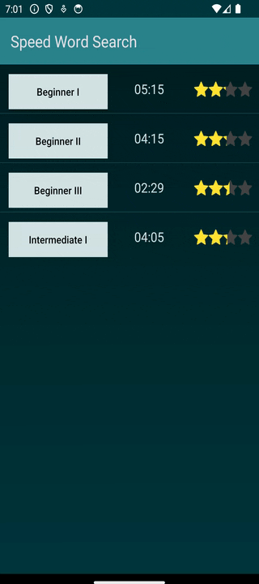
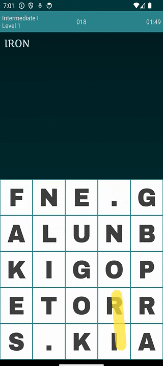

# Speed Word Search Game

Welcome to the Speed Word Search app for Android!

You have 2 minutes to find all the words. Beware that as you are searching for the words and removing them from the list, the board is changing and new words are being added in!

## Splash Screen

I made a simple splash screen where the game's name are shown as tiles and they pop into view:

## Levels

The game has top levels named "Beginner I", "Intermediate II" etc. and each of those levels and 10 sub-levels under it. 

## History and Scores

Each top-level is scored based on the scores of the sub-level. The sub-level scores are based on a combination of how much time was left on the clock and how many words were found.

All the scores and progress are stored via game files so that the next time you start playing, you can continue where you left off. 

## Game Play

The hidden words are listed on the top section of the game screen. The grid of letters are in the bottom half. Search for any of the words in the list but they must be in a straight or diagonal line (total of 8 directions: N, E, S, W, NE, NW, SE, SW).

Once you find a word, click on the first letter. Then click on the second letter. Alternatively, you can use the drag motion by starting with the first letter and ending at the last letter. If the word matches, your score will increase and the word will disappear from the top list.

## Scoring

Each word gets points based on its length. Two of the four stars are based on how many points you got out of maximum points possible based on all the words on the board. The last two stars are based on the amount of time you took to complete the level. If you score 2 out of 4 stars, you unlock the next level. Following is the animation on winning a level:

# Privacy Policy

As an avid Android user myself, I take privacy very seriously. I know how frustrating it is when apps collect your data without your knowledge.

## Data collected by the app

I hereby state, to the best of my knowledge and belief, that I have not programmed this app to collect any personally identifiable information. All app preferences (like sound controls) and level progress are created by you (the user) and is stored locally in your device only. This data can be simply erased by clearing the app's data or uninstalling it. No analytics software is present in the app.

## Explanation of permissions

Currently, the app is in testing / beta. Therefore, it shows no ads at the moment. After testing, I plan to insert family friendly ads and also allow the user to purchase an ad free version. Once that happens, the appropriate permissions for displaying ads will be added.

## Report Issues

If you find any security vulnerability that has been inadvertently caused by me, or have any question regarding how the app protectes your privacy, please create an issue on the repo and I will surely try to fix it/help you.

# License

This code is provided under the "Creative Commons NonCommercial NoDerivatives" license. AKA [CC BY-NC-ND](https://github.com/Gibberlings3/GitHub-Templates/blob/master/License-Templates/CC-BY-NC-ND-4.0/LICENSE-CC-BY-NC-ND-4.0.md). 
